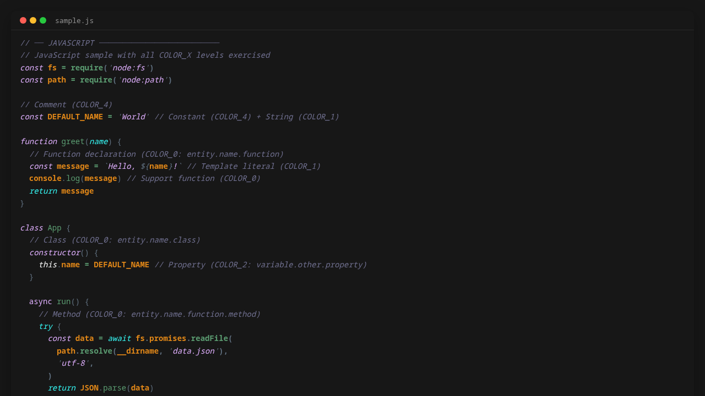
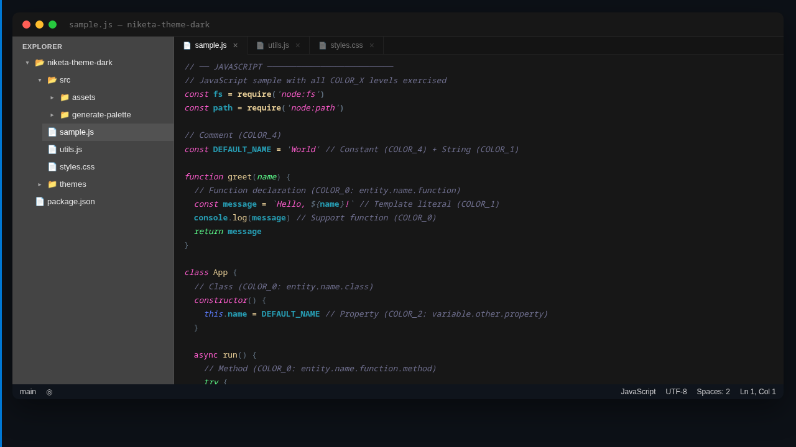
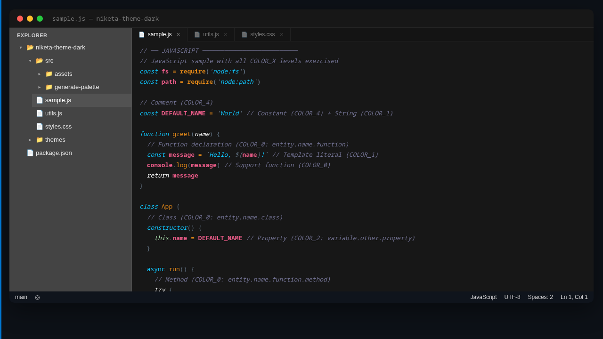
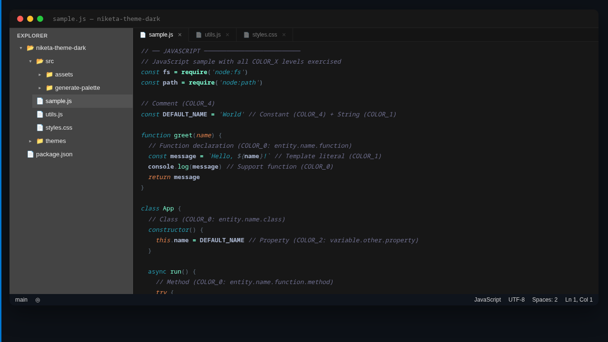
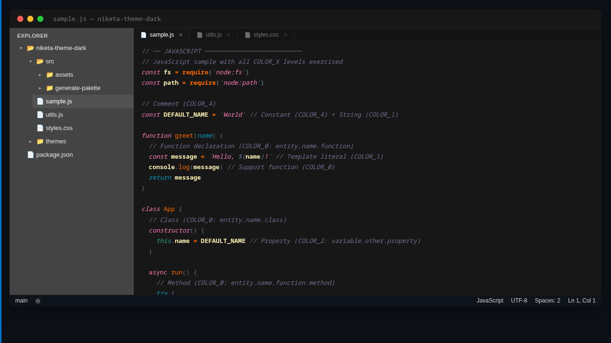
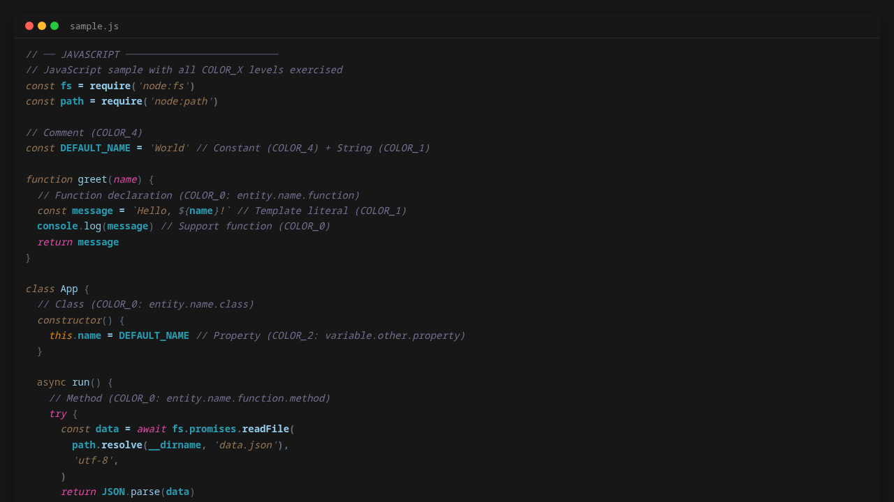
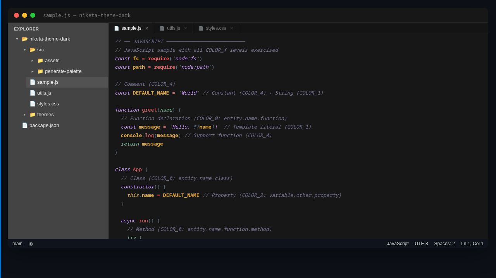
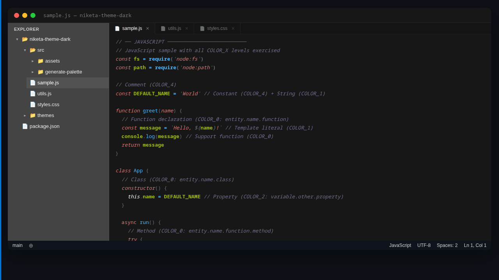
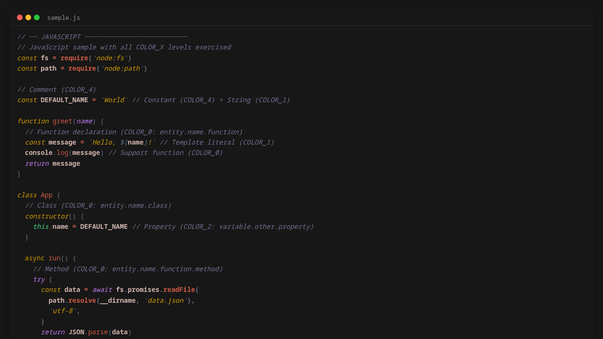

# Niketa Dark

9 Dark VSCode Themes with same background

## Screens

### American Dad

### Aqua Teen Hunger Force

### Archer

### Cleveland Show

### Dilbert

### Home Movies

### South Park

### Trip Tank

### Ugly Americans

## Naming

These are some of my favorite TV series

## Light theme

This set of themes is based on [Niketa theme](https://marketplace.visualstudio.com/items?itemName=selfrefactor.Niketa-theme), which is set of 9 light themes.

## Zed extension

`yarn out` (or `yarn out:zed`) also generates a [Zed](https://zed.dev) theme extension into `zed-extension/`
containing all dark themes from this repo plus the light themes from the sibling
[Niketa theme](https://marketplace.visualstudio.com/items?itemName=selfrefactor.Niketa-theme) repo
(when present; point `LIGHT_THEMES_DIR` elsewhere if that repo lives elsewhere):

1. Run `yarn out` to regenerate the themes and the extension.
2. In Zed open the Extensions panel (`zed: extensions`).
3. Click **Install Dev Extension** (or run `zed: install dev extension`).
4. Select the `zed-extension/` directory.
5. Pick a theme via `theme selector: toggle` (`cmd-k cmd-t`).

The conversion is a best-effort port of the VS Code themes (TextMate scopes are folded into
Zed's syntax tags, UI colors into Zed's style keys); unmapped scopes are reported by
`out:zed` so the table in [`src/lib/vscode-to-zed.js`](src/lib/vscode-to-zed.js) can be extended.
