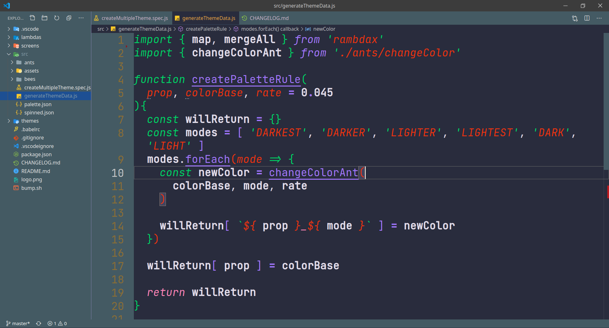
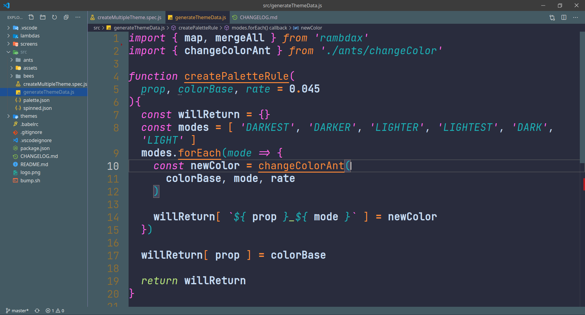
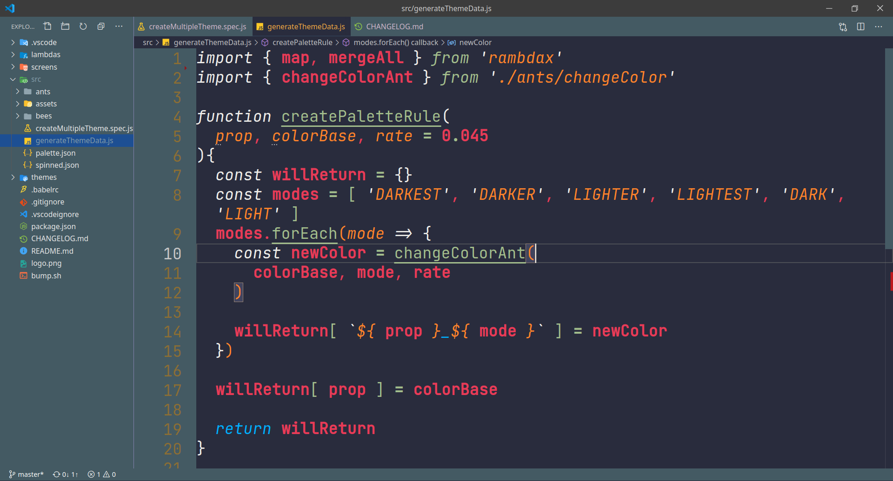
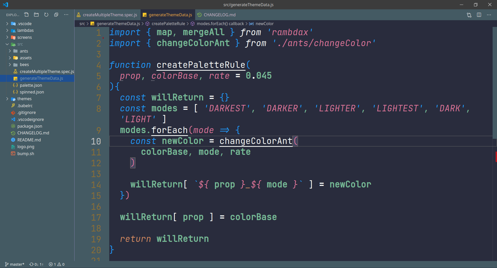
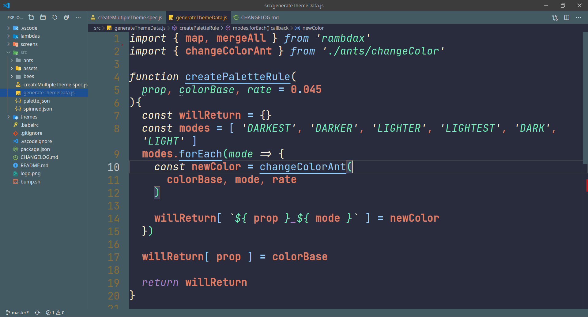
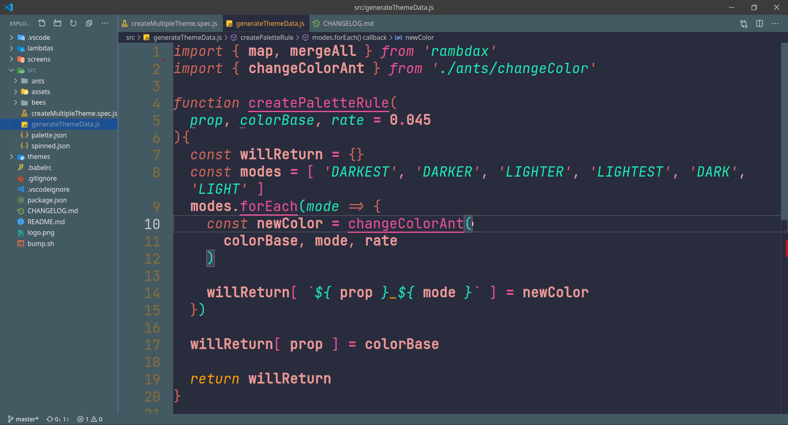
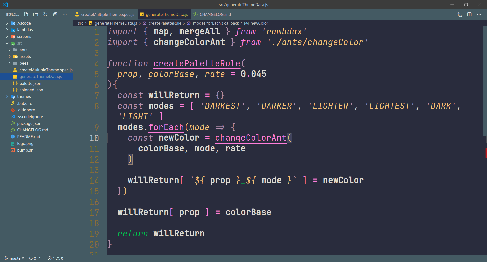
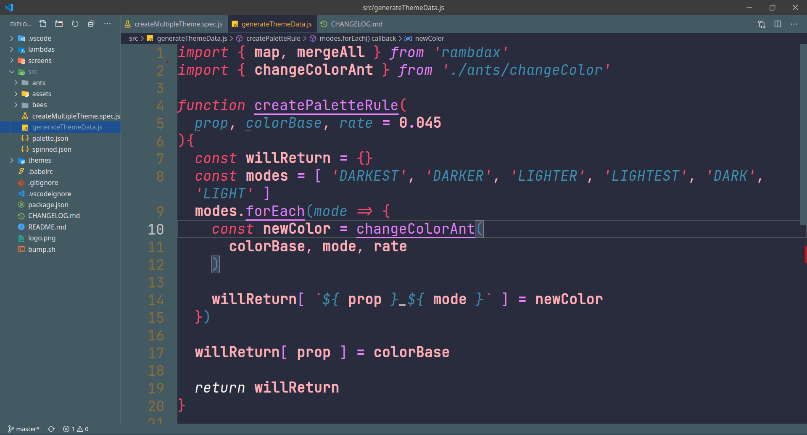
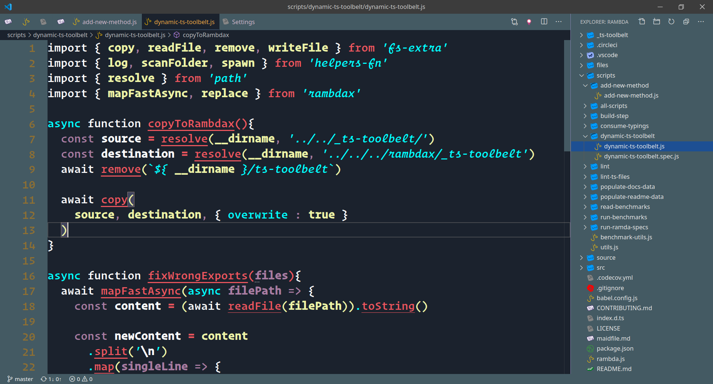

# Niketa Dark

9 Dark VSCode Themes with same background

## Screens

### American Dad

### Aqua Teen Hunger Force

### Archer

### Cleveland Show

### Curb Your Enthusiasm

### Dilbert

### South Park

### Trip Tank

### Ugly Americans

## Naming

These are some of my favorite TV series

## Light theme

This set of themes is based on [Niketa theme](https://marketplace.visualstudio.com/items?itemName=selfrefactor.Niketa-theme), which is set of 9 light themes.
